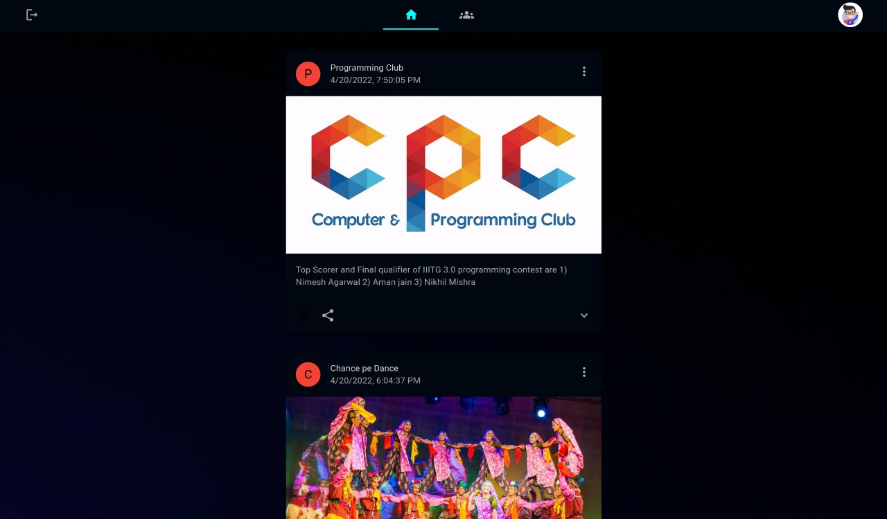
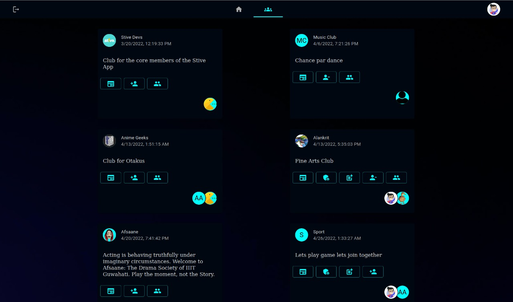

# Stive 

## Project Description
A platform for management and administration for the clubs related activites to ensure a smooth and organized workflow.

## Proposed System
The platform proposed by us aims to improve the efficiency, management, communication and administration of student activities.
* Website and application for the users to interact with the platform
* Calendar for events
* User interaction via polls 
* Club updates posts
* Member management system


### Commands to run the Project:
```
git clone git@github.com:StiveDevs/Stive-web-application.git

cd Stive-web-application/

npm install

npm start

```

#### Homepage


#### Club Page


#### Project Detials
Frontend Team Members : Anshuman Kumar && Ayush Das <br />
[Presentation Report](https://docs.google.com/presentation/d/1t7OKg11eji6c12KOXRGFOIITZKXcb39DpeqtMVmpkK8/edit#slide=id.p)<br />
[Testing Report](https://docs.google.com/presentation/d/1t7OKg11eji6c12KOXRGFOIITZKXcb39DpeqtMVmpkK8/edit#slide=id.p) 


#### References<br />
https://reactjs.org/tutorial/tutorial.html/<br />
https://mui.com/material-ui/getting-started/overview/<br />
https://stackoverflow.com/<br />
https://www.youtube.com/results?search_query=mui+tutorial<br />